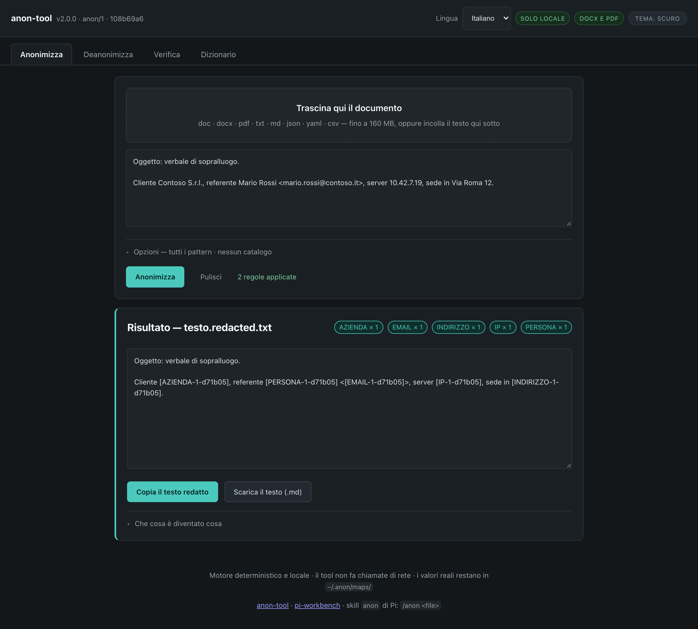
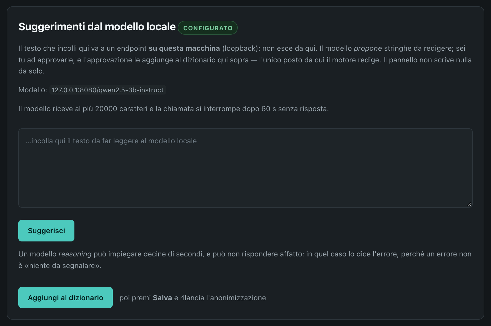

<p align="center">
  
</p>

<p align="center">
  <em>Hand a document to an AI without handing over who it is about.</em>
</p>

<p align="center">
  <strong>v2.0.0</strong> — <a href="CHANGELOG.md">changelog</a>
</p>

---

## Why this exists

A maintenance report that reads *"Client X, three sites, the site manager is Mr Y, 30 open tickets
on `X-PROD-01` at 1.2.3.4"* is, in practice, a list of names. Strip the names and the addresses, keep
the technical substance — the counts, the models, the findings — and the document still says
everything it had to say, without saying who it is about.

`anon-tool` performs that substitution deterministically and locally: it replaces the identifying
parts of a document with typed placeholders (`[EMAIL-1-a3f9d1]`, `[CLIENTE-2-a3f9d1]`), leaves a
reversible map on your machine, and puts the real values back into the finished document at the
end — after the AI has worked on text that never named anybody.

## The rule the whole design follows

> The anonymizer is not an AI.

To anonymize a text, a model would first have to receive it: an LLM-based anonymizer transmits
exactly what it claims to protect. That is a contradiction, not a tuning problem. Detection is
therefore deterministic — regular expressions, a curated dictionary, and checksum validators for
Italian identifiers — and entirely local: standard library only, no network capability, no
telemetry, no credentials.

The AI re-enters only *after* redaction, when you or an agent analyze the redacted text. The one
exception is the optional suggester below: it **does** read raw text, but only through a local model
on your own machine, only when you ask for it, and it can do nothing but propose.

**The suggestion model runs in the container, beside the UI.** `make model` downloads
Qwen2.5-3B-Instruct (Q4_K_M, ~2 GB; the size and sha256 come from the model repository's
metadata and were confirmed against the first completed download) and starts it as a sidecar that
**shares the UI container's network namespace** (`network_mode: service:anon-tool`). That detail is
the whole point: the seam is loopback-only by decision (DEC-0018, DEC-0019), a second service on the
compose network would have its own IP and be refused, while in a shared namespace `127.0.0.1:8080`
is the same loopback for both — the invariant is honoured, not weakened, and nothing new is exposed
(the port is not published). The model is for *extraction* (name the strings worth redacting), not
reasoning: a 9B reasoning model answered with a "Thinking Process" narrative instead of JSON, which
the seam reported as an error rather than an empty list — correctly. A small instruct model with a
bounded `--max-tokens` is the right shape, and that is what ships. The full measured picture,
including the runs that fail, is in the seam section below. **Measured end to end** (UI → server →
model, this machine, 6 CPU threads): a 570-character Italian report answered in **37.3 s** with **5
proposals** — Ancona, Milano, Prato, Bologna and one address — of which four were NOT found by the
deterministic engine (it found the email and the phone). That is exactly the feature: the contextual
reference the dictionary cannot know. The cost is the latency (21.6 tokens/s on the prompt, 6.7
generating), so the panel is a step you run when you want it, not a step in the upload path. The
same 3B is precise but adds nothing on short, structured texts: against the labelled corpus
(`scripts/bench-suggest.py --corpus`) it scored precision 11/11 and recall 10/28, with every
proposal a value the engine already found and 0 of 4 declared holes closed — the yield is
text-dependent, and the report above is where it helps. The
tests that need a model are gated behind `ANON_MODEL_URL`; to run them against the containerized
model, share its network namespace:

```bash
docker run --rm --network container:anon-tool -v "$PWD":/repo -w /repo --entrypoint python3 \
  -e ANON_MODEL_URL=http://127.0.0.1:8080/v1/chat/completions -e ANON_MODEL_NAME=qwen2.5-3b-instruct \
  anon-tool:local tests/test_suggest.py LocalModelTest
```

**The interface speaks Italian and English; Italian is the default.** The switcher sits in the
header and the choice is remembered (`localStorage`, key `anon-lang`). The Italian text lives in
`web/index.html` and is the fallback, so a missing translation shows Italian rather than an empty
label; the English lives in `web/i18n.js`, keyed by a selector per element — a paragraph that mixes
text with `<strong>`/`<em>` is replaced whole, because word order differs between languages. A test
fails when a key no longer matches an element. What is NOT translated yet: the messages the server
produces (progress, errors) and the tooltips; the engine is language-neutral either way.

**Italian first, not Italian only.** The checksum validators and the `legal` pattern group are
built around Italian identifiers (codice fiscale, partita IVA, IBAN, plates, addresses), and two of
the four shipped catalogs are Italian (municipalities, consumer mail domains). Everything else —
emails, IPs, hostnames, URLs, phone numbers, the dictionary format, the placeholder machinery — is
language-neutral, and a catalog is just a text file with directives: another country's rules are a
new pattern group plus a list, not a rewrite. The code, the CLI, the tests and this README are in
English; the web UI is in Italian.

## What it guarantees

- **No network capability.** The engine imports the Python standard library and nothing else; there
  is no `socket`, `urllib` or `http` import anywhere in it.
- **Lossless round trip.** `anon → deanon` restores the document byte for byte: the map stores the
  exact matched substring, so spelling variants come back as they were written.
- **Idempotent.** Anonymizing an already-redacted document changes nothing; placeholders present in
  the source are protected, not re-matched.
- **A document can only be restored with *its* map.** Every placeholder carries a per-map tag
  (`[EMAIL-1-a3f9d1]`). Applying a different run's map leaves the placeholders untouched and the
  command exits non-zero instead of substituting another client's values.
- **Open failure modes.** A document that still contains an unresolved placeholder, an unknown
  token, or nothing to restore at all is reported as *incomplete* — never passed through silently.
- **Validated identifiers.** Codice fiscale, partita IVA, IBAN and plate numbers are verified
  against their checksum, which keeps false positives near zero — the opposite of a word list.

## What it does not do

These are declared limits, not oversights:

- **Contextual references** ("the client from Ancona") are not detected. A redacted document still
  needs a human read before it leaves your hands.
- **Images and screenshots** cannot be scanned: pixels pass through, so do not paste a screenshot
  of a client document into a chat.
- **The custom dictionary is curated by hand.** A proper name that is not in the dictionary
  (`entities.txt`, `people.txt`, `clients.txt`) is not redacted. Keeping those files current is the
  one recurring maintenance task.
- **Shell reads** (`cat`, `rg`) are outside the Pi guard's default perimeter; `--anon-guard=all`
  extends it to shell output.
- **It is not a legal opinion** on using a cloud provider. It reduces technical risk; it does not
  replace a DPA or an internal assessment.
- **The private store is not encrypted at rest.** `~/.anon` is `0600` and readable by anything that
  can read it; the encryption belongs to the **backup** you take out of the machine (`make backup`),
  which has no scheduler, no remote destination and no key management of its own.

## Quick start

### Engine (no dependencies)

```bash
python3 anon.py report.txt                       # -> report.redacted.txt + a map in ~/.anon/maps/
python3 anon.py report.txt --check --json        # is this safe to read? (exit 1 if not)
python3 anon.py report.txt --dry-run             # what WOULD be redacted, and where — writes nothing
python3 anon.py ./cliente --batch --dry-run      # the same for a whole folder, before touching it
python3 anon.py ./cliente --batch                 # -> *.redacted.* next to each source (never over it)
python3 anon.py verbale.docx                     # -> verbale.redacted.docx: same type, same layout
python3 anon.py report.txt --audit               # is an ALREADY redacted file really redacted?
python3 anon.py verbale.redacted.docx --audit    # the same question, answered inside the package
python3 deanon.py final.docx <map.json>          # put the real values back (text or .docx/.xlsx/.odt)
python3 convert.py report.docx > report.md       # docx/pdf -> Markdown, locally
python3 anon.py --list-catalogs                  # which built-in lists are installed
python3 anon.py --prune-maps 90                  # list the maps older than 90 days (--yes deletes)
```

### Web UI

```bash
docker compose up -d                             # -> http://127.0.0.1:1407
docker compose --profile slim up -d anon-tool-slim   # text formats only, no converter, port 1408
make model                                       # + the local suggestion model (~2 GB, downloaded once)
# or, without Docker:
python3 web/server.py                            # --rate-limit N caps /api/* (default 120/min)
```

Four tabs, one primary action each: **Anonimizza**, **Deanonimizza**, **Verifica**, **Dizionario**.
Pattern groups and catalogs sit behind an *Opzioni* disclosure, so the default flow is: drop a
document, anonymize, read the result. Dark theme by default, with a light alternative.



The capture is of a **synthetic** document (no real values): the placeholders are typed and carry
the tag of the map that produced them (`[AZIENDA-1-af6c8c]`), and that map is what restores the
real values — it stays in `~/.anon/maps/`, never in the browser. The header carries the version,
the short build fingerprint and the language selector.

Under the result, **Dove è intervenuto** renders the redacted text with one coloured pill per
placeholder, labelled with its type: what left the document is scannable at a glance, and no real
value is ever written to the page (the view is built with `textContent`; the values stay behind
*Che cosa è diventato cosa*).

**Scarica il report** writes a Markdown attestation — tool version and build, the map id, the
substitutions per type and the placeholder list — so a delivery can be checked against the map
without the report ever carrying a real value.

Drop more than one file and they become a **queue**: one card per file, each with its own status
and its own artifacts (the redacted document, the Markdown, the report). They run one after another
from the page, so one document's map can never be shown for another's, and the server still answers
one request at a time. Picking several files does the same; a single file keeps the one-step flow.

Upload a document and you get **two artifacts from one redaction**: the document itself, redacted
in place (`verbale.redacted.docx` — same type, same layout, headers, footers and properties
rewritten where they live), and the Markdown the model reads, **derived from the already redacted
file**. They share one tag and one map, so they can never disagree. A PDF is never rewritten in
place: it is rebuilt as a **new text-only PDF** (layout not preserved, and the panel says so) plus
the Markdown, both from the same map. A package the engine cannot open falls back to the Markdown
alone and says so. The reason not to redact the two
independently: the same placeholder would end up meaning two different values.

`make up | down | logs | native | test | smoke` wraps the same operations.

**A code change reaches the browser only after the container is rebuilt.** The image bakes the code
(the file set is `anon.code_fingerprint`'s, not a list repeated here); the `~/.anon` volume holds data only. `make up` rebuilds (and `make up MODEL=1`
keeps the suggestion-model sidecar attached), then `make check-container` — the `container-fresh`
gate in `.pi/verify.json` — compares the build fingerprint the container reports of itself with the
repository's and fails when a running container is stale. The invariant is `DEC-0024`. The version cannot serve as that marker: it
moves on a release, not on a commit, and the header shows the build fingerprint next to it for
exactly that reason.

The upload cap is a default, not a wall: `ANON_MAX_UPLOAD_BYTES` (160 MB, exposed to the page
through `/api/state` so the UI can refuse an oversized file before spending the transfer) raises it
deliberately. Raising it does not raise the converter's own `ANON_CONVERT_TIMEOUT`, nor the 12 MB
the Pi guard is willing to read from a redacted Markdown.

`--batch` walks a directory and refuses what it cannot do safely: binary or unscannable files are
reported and skipped (never copied under a `redacted` name), files over 12 MB are skipped rather
than half-processed, its own `*.redacted.*` outputs are skipped so a second run cannot nest
placeholders, and a directory inside the private store is refused outright. `--batch --check` is the
folder-shaped gate (exit 1 if anything is sensitive); `--out DIR` keeps the sources' folder clean.
Office containers (`.docx`, `.xlsx`, `.pptx`, `.odt`) are rewritten in place, so `--batch` redacts
them too; legacy `.doc/.xls/.ppt`, PDFs and images are still skipped, and `--check` on a container
names the findings *and* keeps `unscannable` — the field the Pi guard's auto-remediation reads —
because that flag describes what the `read` tool would do with the file, not what this engine can.

The container mounts `~/.anon` at `/data`, so the UI, the CLI and the Pi guard all read the same
`entities.txt` and write to the same map directory: one source of truth.

## How the pieces fit

| Piece | Role |
|---|---|
| `anon.py` | engine: detection, redaction, map, `--check`, `--audit` |
| `deanon.py` | inverse: restores the real values, in plain text and inside `.docx/.xlsx/.pptx/.odt` |
| `convert.py` | document → Markdown, using a pinned [anydoc](https://github.com/firecrawl/anydoc) |
| `pdfout.py` | text → a plain text-only PDF: a redacted PDF is rebuilt, never rewritten |
| `web/` | local UI: stdlib HTTP server plus a vanilla front-end (no framework, no CDN, no build) |
| `catalogs/` | opt-in lists: Italian municipalities and consumer mail domains, plus the IT vendor and product lists |
| `~/.anon/maps/` | reversible maps — the only place the real values live, mode 0600, never in a repo |

The Pi integration (a skill and an enforcement extension) ships in
[pi-workbench](https://github.com/Stinocon/pi-workbench): the guard runs in the local harness and
keeps un-redacted content out of the model context, and the skill carries the procedure.

## The dictionary

The curated dictionary lives in `~/.anon`, split by kind so each file stays small — and it never
enters a repository:

- `entities.txt` — the generic fallback: anything that is not a person or a company (`TIPO|valore`).
- `people.txt` — people. Open it with `@type PERSONA` and then one value per line (`Mario Rossi`);
  an entry can carry an email as an alias, written `PERSONA|Mario Rossi|m.rossi@x.it` (or
  `|Mario Rossi|m.rossi@x.it` under the `@type`). The FIRST field is the type: `Mario Rossi|m.rossi@x.it`
  would make the type `Mario Rossi` and leave the name in clear, so the engine rejects it loudly.
- `clients.txt` — companies and their sites. Open it with `@type AZIENDA` and list the company name
  (and, if you want, an address, which is redacted like any other entry).

All three are optional and read together; `--entities PATH` (repeatable) overrides them. A line
without a `TIPO|` prefix takes the `@type` declared above it. Case (`Spa` = `SPA`) and legal forms
(`srl` = `S.r.l.`) are already folded, so one entry covers the whole family. The web UI's
**Dizionario** tab edits the three files through the same engine.

## The catalog system

A catalog is the same file format as the custom dictionary, with directives:

```
@type    CITTÀ
@match   case-sensitive               # `Ancona` matches, `il prato è verde` does not
@context (?:comune di|sede di)\s+     # only after a marker
@context off                          # stop requiring one for the entries that follow
@stem    on                           # `Pincopallino` also covers `Pincopallino1`, `-DB01`
Ancona
```

```bash
python3 anon.py --list-catalogs                          # what is installed
python3 anon.py file.txt --catalogs vendors              # IT vendors (one line per company)
python3 anon.py file.txt --catalogs it-cities,free-mail-domains
python3 anon.py file.txt --patterns legal,identity
```

Every catalog is **off by default**. Redacting more is not automatically better: a report where
each city has become `[CITTÀ-1]` loses its substance and protects almost nothing extra. The one
catalogs written for every infrastructure report are the pair `vendors.txt` (the companies) and
`products.txt` (their products and platforms: `FortiGate`, `PowerEdge`, `Windows`, `Docker`). Each
is split into a case-sensitive block (`Dell`, `Canon`, `Axis`, `HP`; `Word`, `Excel`, `Windows`,
`Catalyst`: names that are also ordinary Italian or English words) and a case-insensitive one, and
the split is enforced by the test suite. See `catalogs/README.md`.

## The local-model seam (optional, off by default)

`suggest.py` is where a **local** model plugs in as a detector. It is a client of the engine, not
part of it: it asks a loopback endpoint for candidate strings, locates them in the document itself,
and prints them as **proposals**. It writes no redacted file and no map, and the engine never
imports it — the arrow is one-way and tested.

The same thing exists in the UI, in the **Dizionario** tab, because approving a proposal *is* a
dictionary edit: paste the text, press *Suggerisci*, tick what is real, pick a type, and
*Aggiungi al dizionario* appends those lines to the dictionary file you are editing. Then save and
re-run the anonymization. The panel is always visible: without an endpoint it is inert, the fields
are closed in the HTML before any script runs, and it says how to turn the seam on.



Configured, not running: the panel names the model it will call and the bounds it keeps — the model
only ever *proposes*, and approving a proposal is an ordinary dictionary edit.

Measured on this machine, and worth knowing before you expect magic: a **reasoning** model spends
its whole budget thinking, and its failures wear different faces. The local MTPLX Qwen3.5-9B is the
case in point: a one-sentence text gets a correct proposal in about 30 s; a richer text spends
**138 s and 4096 tokens** and returns nothing (`finish_reason: length`); and in one run it answered
after **43.4 s** with a "Thinking Process" narrative instead of JSON. Every one of those is reported
as an error — the CLI says *"the backend did not answer: …"* (exit 2) and the UI shows *"the local
model did not answer: …"* (HTTP 502) — instead of pretending it found nothing. That is the correct
behaviour, and it means the model is the part to choose: a small instruct model, or a bigger
`--max-tokens`, is the operator's call. What the seam guarantees is that a proposal is never taken
on trust and a failure never looks like a clean document.

**How much text it will actually read, declared up front.** The model receives at most the first
**20 000 characters** of the text (`--max-chars`, on both the CLI and the UI's own window); the UI
counts them live as you paste and says so, and the CLI reports `analyzed_chars` / `TRUNCATED`. That
transport cap is not the practical limit: on this CPU a page or two already takes minutes, and the
request gives up after the **60 s** timeout (`--timeout` on `suggest.py`, `--suggest-timeout` on the
UI server) — a long text does not hang, it answers with an error. The panel shows elapsed seconds
while it waits, so the call reads as working rather than frozen. To read more at once, split the
document, raise the timeout, or point the seam at a faster model.

**A document longer than the window can be COVERED, not cut — opt-in.** With `--chunk-chars` on
`suggest.py` (or `--suggest-chunk-chars` on the UI server) the text is split into overlapping
windows of that size, one model call each, and the proposals are merged **by value**: the same
value seen by two windows is one candidate, its occurrences counted once. The overlap
(`--chunk-overlap`, default 500) is what keeps a value that straddles a cut whole in at least one
of the two windows, and the boundaries are nudged to whitespace so a token is never cut in half —
half an email is a prefix the engine would propose as if it were the value. The report and the
panel then say the document was covered in *N* chunks instead of `TRUNCATED`. It is off by default:
it multiplies the calls — and the waiting — by the number of windows, so the single window stays the
cheap default, and a pair that cannot advance (`--chunk-overlap` not smaller than `--chunk-chars`)
is refused at startup rather than looped on.

**The answer arrives while it is being written.** The panel reads the model's reply as server-sent
events (`/api/suggest-stream`) and shows the text as it comes, instead of a bar that sits still for
twenty seconds; `suggest.py --stream` does the same on a terminal, printing the deltas on stderr and
the report on stdout. The deltas are **progress, not a verdict**: the proposals are built only when
the whole answer has arrived, been parsed and located in the document, exactly as in the blocking
call, so a half-written value cannot become a proposal. A stream that breaks is an error — an
`error` event in the UI, exit 2 on the CLI — never a short answer that looks complete.

```bash
python3 suggest.py verbale.txt --entities ~/.anon/clients.txt \
    --url http://127.0.0.1:11434/v1/chat/completions --model <nome-modello> --json
```

- **Loopback only**: `localhost`, `127.0.0.0/8` or `::1`. Anything else is refused before a byte is
  sent — this tool's contract is that a document does not leave the machine.
- **Fail-closed**: a backend that does not answer is an error (exit 2), never an empty "nothing
  found" (exit 0). A candidate list is exit 4: to review, not a verdict.
- **The model never decides what is redacted**: a value it returns that is not in the document is
  dropped, and applying a proposal stays `anon.py`'s job.

**The answer's SHAPE is enforced, not hoped for.** `--suggest-constrained` puts a JSON Schema in the
request (`--constrained` on `suggest.py`) and the backend constrains the decoding to it, so a model
that would narrate its "thinking process" cannot produce a non-schema reply — the failure class is
removed, not reported. It is **off by default**: an endpoint that rejects the field would turn every
call into a 400, and the shipped sidecar is where it is turned on.

The panel is always in the Dizionario tab and tells you whether the seam is configured; with no
model it is inert and says how to enable it.

**The shipped model works inside the container**, because the sidecar shares the UI's network
namespace, so `127.0.0.1:8080` is the same loopback for both: `make model` (or `make up MODEL=1`)
brings UI and model up together and the server is already pointed at it. What the loopback rule
still refuses is a model **on the host**: `host.docker.internal` is not loopback, and the rule that
keeps a document on this machine is the same rule that keeps the container from reaching a model
outside it. To use such a model, run the UI natively and point it at it:

```bash
python3 ~/.anon/web/server.py --port 1407 \
    --suggest-url http://127.0.0.1:8000/v1/chat/completions \
    --suggest-model <nome-modello> --suggest-max-tokens 4096
```

See `docs/DESIGN.md` §7 for the boundary and `CHANGELOG.md` for the shipped model and what it was
measured to do.

## The private store, and its backup

Everything that must never be committed lives in one directory, `~/.anon`: the **maps** (the real
value behind every placeholder — the only thing that makes a redacted document reversible), the
private dictionary (`entities.txt`, `clients.txt`, …) and the files the UI hands back. The engine
creates the directory `0700` and writes every file `0600` (`anon.py::_write_private`).

**It stays in clear.** The store is not encrypted at rest, and that is a decision rather than an
oversight ([`DEC-0033`](.pi/decisions/DEC-0033.md)): `anon.py` writes and rereads a map with no key,
so a passphrase has nowhere to live that does not end up beside the maps it is protecting. The
encryption belongs on the copy that leaves the machine:

```bash
make backup                             # -> ~/private-backups/anon-home-<date>.tar.gz.enc
make restore FILE=~/private-backups/anon-home-20260925-1941.tar.gz.enc
```

The archive is AES-256-CBC over PBKDF2 (600 000 iterations) and is **verified in the same run that
writes it**: the script decrypts it again and compares every file with a sha256 manifest kept
inside the archive, and the file count against the manifest's lines. `restore` runs the same
verification *before* it writes anything — a payload that contradicts its own manifest, a member
named `../`, a symlink member or a wrong passphrase is refused with the destination untouched — and
it never deletes: a non-empty `~/.anon` is **moved** to `~/.anon.pre-restore-<date>` first, and only
`--force` asks for that.

What goes in: everything under `~/.anon` except `models/` (2 GB, re-downloadable with `make model`),
`__pycache__/` and `*.pyc`. Contents, paths and modes travel; the filesystem's own bookkeeping
does not — extended attributes and ACLs are stripped, so an archive made on a Mac extracts cleanly
with GNU tar on Linux. The passphrase is asked for on a terminal and never stored anywhere (a
non-interactive run with no terminal refuses instead of hanging on a prompt); scripted use can set
`ANON_BACKUP_PASSPHRASE`, which is also why it is not the default — the variable is read once and
removed before the script starts any other program, but a same-user process can still read it from
the environment while the script is starting.

Limits, stated rather than implied: no scheduler, no remote destination, no key management, and no
AEAD — CBC alone cannot prove *who* wrote an archive, so the manifest inside detects a modified or
damaged payload while the passphrase's secrecy is what keeps an archive authentic. Two names a tar
cannot carry faithfully are refused by name instead of producing a broken archive: a stored file
whose name contains a newline (the manifest is line-based), and one whose name starts with `._`
(bsdtar reads that as AppleDouble metadata for its sibling and writes an archive that will not
extract). An empty directory is not restored — the engine creates the ones it writes into — and lose
the passphrase and the archive is lost, by design. `scripts/anon-home-backup.sh` and
`tests/test_backup.py` are the whole mechanism.

## Security posture

The web UI has **no authentication**, and that is acceptable *only* because it is bound to
loopback: the container publishes `127.0.0.1:1407:1407`, never `1407:1407`, and the server refuses
a non-loopback bind unless `--allow-lan` is passed explicitly. Requests must carry the correct
`Host` header and a per-run token delivered through a CSP nonce; a foreign `Origin` is refused. No
client-supplied filesystem path is ever used.

The API is additionally rate limited (token bucket, `--rate-limit`, 0 disables it), so a runaway
script cannot pin every worker thread, and the document converter's output is capped *while* it is
produced rather than after it has been buffered.

The Pi guard (and `anon.py --check`) treats a path listed in `~/.anon/allow.txt` as un-sensitive.
For a one-off or session-scoped exemption there is `anon.py --allow-glob GLOB` (repeatable) and, in
Pi, `--anon-guard-allow` / the `/anon-allow` command — so the permanent allowlist is reserved for
genuinely public paths. The allowlist is still evaluated by the engine, never by the guard.

A **binary document** read through Pi (docx, pdf, xlsx) is not a dead end: the guard converts and
anonymizes it locally (`--anon-guard-auto=ask|on|off`, default `ask`) and only the redacted
Markdown reaches the context. If the conversion fails, the read is blocked — the failure path is
the fail-closed block, never "clean". The guard's path is the *read*; for a document you intend to
**deliver**, `anon.py` (or the UI) hands back the same file type with the layout intact.

The full perimeter and the threat model are in [`SECURITY.md`](SECURITY.md) and
[`docs/DESIGN.md`](docs/DESIGN.md).

## Development

```bash
make test      # engine suite, web integration, UI load check, doc-number gate
make smoke     # build the container and exercise every endpoint
make up-slim   # the text-only container variant (port 1408)

# A green suite says the tests PASS. These two ask what that does not: does the suite RUN the
# engine, and would it FAIL if the engine were wrong? Both are gates (CI and `.pi/verify.json`).
make coverage  # how much of the shipped engine the suites execute, with a floor that fails
make mutate    # one deliberate defect per invariant; the named test must fail on each

# How fast can the engine check a file? The Pi guard's size cap is derived from this measurement,
# and the number depends on the dictionary size — run it with the dictionary you actually use.
python3 scripts/bench-check.py --mb 8 --entities 200
# What does the engine MISS? The labelled corpus (tests/corpus.py) declares its own dictionary and
# the values that must be redacted; `make recall` is the number `fp-sweep.py` does not give.
make recall
# What does indexing a container's visible text cost? Both implementations, measured.
python3 scripts/bench-index.py --mb 16
# Is 6 hex digits enough for the per-map tag? Measured, not argued.
python3 scripts/tag-collision.py
# What does .docx -> Markdown lose, and why the in-place path exists? (headers, metadata,
# comments, tracked changes — the six features the container pass now covers)
python3 scripts/convert-fidelity.py
# Refresh the converter's hashed pin after a version bump.
python3 scripts/pin-converter.py > requirements-anydoc.txt
```

The converter is installed from `requirements-anydoc.txt` with `--require-hashes`, so a swapped
wheel cannot enter the image or the native venv.

`scripts/coverage.py` measures the lines of `anon.py`, `deanon.py`, `suggest.py` and `pdfout.py`
the suites actually execute, with the stdlib's `sys.monitoring` and the monitoring propagated into
the CLI subprocesses (or every line they run would count as uncovered); it fails below a floor that
sits a few points under the measured value, so an optional skip cannot fail it while a real loss
can. `scripts/mutate.py` is the sharp gate: it copies the tree, applies ONE deliberate defect at a
time — a reused literal placeholder, a tag collision, an unterminated tag, a false completeness
verdict, a shifted PDF xref, a proposed hallucination, a passphrase refusal that does not stop the
run — and requires the named test to FAIL on each. A defect that survives is a hole in the suite,
and the gate exits non-zero. Both run in CI and in the local verify gate.

`docs/OPEN-ISSUES.md` records what is intentionally left for a later pass.

## License

MIT — see [`LICENSE`](LICENSE). Third-party components and their provenance are listed in
[`NOTICE.md`](NOTICE.md).
